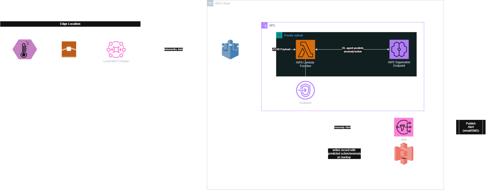

# Grid IoT RL - Power Grid Voltage Control with Reinforcement Learning

End-to-end IoT MLOps pipeline: edge sensors → AWS cloud → DQN RL agent → real-time decisions.

## Architecture



*Simplified view - the detailed flow below also includes the IoT Rule trigger,
the Device Shadow return path, and Secrets Manager/CloudWatch, omitted above for clarity.*

```
Edge Device (sensor readings every second)
       │ MQTT over TLS 1.2 (mTLS + HMAC-SHA256)
       ▼
AWS IoT Core (VPC-connected)
       │ IoT Rule → Lambda trigger
       ▼
AWS Lambda (VPC private subnet)
       ├── Security: HMAC verify + replay check + input validation
       ├── SageMaker endpoint → DQN RL action
       ├── S3 → store enriched record (JSON)
       ├── IoT Device Shadow → send action back to edge
       └── SNS → alert if fault detected
```

## Services used

| Service | Role |
|---|---|
| IoT Core | receive MQTT, route to Lambda |
| Lambda | orchestrate - runs in VPC private subnet |
| SageMaker | DQN RL inference endpoint |
| S3 | permanent data lake |
| SNS | alert emails |
| Secrets Manager | HMAC secret (never in code) |
| CloudWatch | logs, alarms, dashboard |
| VPC | Lambda isolated in private subnet with NAT |

## Folder structure

```
grid-iot-rl/
├── infrastructure/          ← Terraform - deploy AWS once
│   ├── main.tf              ← VPC + all modules
│   ├── variables.tf
│   ├── outputs.tf
│   ├── versions.tf
│   ├── terraform.tfvars.example
│   ├── lambda/
│   │   └── src/
│   │       └── lambda_function.py   ← deployed by Terraform
│   └── modules/
│       ├── iot/             ← Things + certs + policy
│       ├── lambda/          ← function + VPC config
│       ├── iam/             ← all IAM roles (Lambda, SageMaker, IoT rule)
│       ├── storage/         ← S3 bucket
│       ├── alerting/        ← SNS topic
│       ├── monitoring/      ← CloudWatch alarms + dashboard
│       └── secrets/         ← Secrets Manager
│
├── edge_simulator/
│   ├── local/               ← run on laptop
│   │   ├── publish_to_iot.py
│   │   ├── data_generator.py
│   │   ├── requirements.txt
│   │   ├── certs/           ← copy from ../certs/ after terraform apply
│   │   └── modules/
│   │       ├── noise_injector.py
│   │       ├── network_impairments.py
│   │       └── attack_simulator.py
│   └── colab/               ← upload to Google Drive, run in Colab
│       ├── multi_device_simulator.ipynb
│       ├── publish_to_iot.py
│       ├── data_generator.py
│       ├── requirements.txt
│       ├── certs/           ← copy cert files here before uploading to Drive
│       └── modules/
│
├── rl_model/
│   └── grid_voltage_notebook.ipynb  ← train + deploy RL agent
│
├── certs/                   ← auto-generated by Terraform (gitignored)
│   ├── root-CA.crt
│   ├── edge-device-001/
│   ├── edge-device-002/
│   └── edge-device-003/
│
└── docs/
    ├── test_scenarios.md
    ├── architecture-diagram.png
    └── Grid_IoT_RL_Presentation.pptx
```

---

## Setup - 5 steps

### Step 1 - Prerequisites

**What you need on your machine:**

| Requirement | Why |
|---|---|
| An AWS account with a payment method on file | this deploys real, billed resources — see *Cost* below |
| An IAM Access Key ID + Secret Access Key | for a user/role that can create VPC, IoT, Lambda, IAM, S3, SNS, SageMaker, Secrets Manager, and CloudWatch resources. `AdministratorAccess` is the simplest path for trying this out; scope it down for anything beyond evaluation |
| [Terraform](https://developer.hashicorp.com/terraform/install) >= 1.5.0 | provisions all AWS infrastructure |
| [AWS CLI v2](https://docs.aws.amazon.com/cli/latest/userguide/getting-started-install.html) | used by Terraform and by the verification commands later in this doc |
| Python 3.11+ | generates the HMAC secret, runs the RL notebook, runs the edge simulator |
| Git | to clone this repo |

```bash
git clone https://github.com/hrshimpi/power-grid-iot-RL-pipeline.git
cd power-grid-iot-RL-pipeline

# install terraform
brew install terraform        # mac
# or: https://developer.hashicorp.com/terraform/install

# install AWS CLI and configure
aws configure
# enter: Access Key, Secret Key, region (us-east-1 -- see Region note below), json
```

**Region:** this project is built and tested against `us-east-1`. The RL notebook pulls a
prebuilt PyTorch container image from AWS's own SageMaker registry, and that registry's
account ID differs per region (`763104351884` for `us-east-1`) — currently hardcoded in
`infrastructure/modules/iam/main.tf` and in the notebook's `IMAGE` variable. Deploying to a
different region means finding [the correct registry account for that region](https://docs.aws.amazon.com/sagemaker/latest/dg/notebooks-available-images.html)
and updating both places; sticking with `us-east-1` avoids that entirely.

**Cost:** this isn't free-tier-only. Roughly: NAT Gateway ~$0.045/hr + data processing,
SageMaker endpoint ~$0.065/hr while it's deployed. Everything else (Lambda, IoT Core, S3,
SNS, Secrets Manager, CloudWatch) is negligible at this scale. Delete the SageMaker
endpoint and run `terraform destroy` when you're done — see *Clean up* below.

**Deploying under your own AWS account:** the code has no hardcoded account IDs or
personal values — it's designed to be cloned and deployed fresh by anyone. The one thing
that can collide: S3 bucket names are unique *globally*, not just within your account. If
`terraform apply` fails with a bucket-name-already-exists error, change `project` or `env`
in `terraform.tfvars` to get a different bucket name and re-apply.

### Step 2 - Deploy AWS infrastructure

```bash
cd infrastructure

# configure
cp terraform.tfvars.example terraform.tfvars

# generate the shared HMAC secret (edge devices <-> Lambda payload signing)
python -c "import secrets; print(secrets.token_hex(32))"

nano terraform.tfvars
# set: alert_email, hmac_secret (paste the value generated above), aws_region

# deploy (creates VPC, IoT, Lambda, S3, SNS, Secrets Manager, certs)
terraform init
terraform apply
# type: yes
# takes ~3 minutes
```

After apply, note the outputs:
```
iot_endpoint   = "xxx-ats.iot.us-east-1.amazonaws.com"
s3_bucket      = "grid-iot-rl-dev-data-lake"
lambda_function = "grid-iot-rl-dev-inference"
```

Cert files are auto-generated in `certs/` folder.

### Step 3 - Copy certs to edge simulators

```bash
# for local run
cp -r certs/* edge_simulator/local/certs/

# for Colab run
cp -r certs/* edge_simulator/colab/certs/
```

### Step 4 - Train and deploy RL model

```bash
# open in Jupyter or SageMaker Studio
open rl_model/grid_voltage_notebook.ipynb
# run all cells - takes ~15 minutes
# endpoint: grid-voltage-rl-v1
```

The notebook derives the S3 bucket, SageMaker execution role, and endpoint name from the
same `project`/`env` prefix Terraform uses (`grid-iot-rl-dev-*` by default), so they can't
drift out of sync with what `terraform apply` created. If your `terraform.tfvars` uses
non-default `project`/`env` values, override before running the notebook:

```bash
export GRID_PROJECT="grid-iot-rl"     # must match terraform.tfvars: project
export GRID_ENV="dev"                 # must match terraform.tfvars: env
export AWS_REGION="us-east-1"
# S3_BUCKET, SAGEMAKER_ENDPOINT, SAGEMAKER_ROLE_ARN, AWS_ACCOUNT_ID can each be
# overridden individually too - see Cell 8b in the notebook
```

### Step 5 - Run edge simulator

**Option A - local laptop:**
```bash
cd edge_simulator/local
pip install -r requirements.txt

# configure once - copy the template and fill in IOT_ENDPOINT / HMAC_SECRET
cp .env.example .env

# --client-id picks which provisioned device you're publishing as
# (edge-device-001 / 002 / 003) - a per-run flag, not part of .env
python publish_to_iot.py --client-id edge-device-001 --count 10 --mode happy
```

**Option B - Google Colab (3 devices simultaneously):**
1. Copy certs into `edge_simulator/colab/certs/` subfolders
2. Upload `edge_simulator/colab/` folder to Google Drive
3. Open `multi_device_simulator.ipynb` in Colab
4. Set `IOT_ENDPOINT` and `DRIVE_FOLDER` in Cell 3
5. Run all cells

---

## Test scenarios

```bash
# normal
python publish_to_iot.py --count 5 --mode happy

# faults
python publish_to_iot.py --count 5 --inject voltage_sag
python publish_to_iot.py --count 5 --inject overcurrent
python publish_to_iot.py --count 5 --inject frequency_drop
python publish_to_iot.py --count 5 --inject multi_fault

# network impairments
python publish_to_iot.py --count 10 --loss 0.10
python publish_to_iot.py --count 5  --latency 3.0

# security attacks
python publish_to_iot.py --count 5 --replay
python publish_to_iot.py --count 5 --mode attack

# chaos
python publish_to_iot.py --count 20 --mode chaos --fault-rate 0.2
```

---

## Verify pipeline

```bash
# Lambda logs
aws logs tail /aws/lambda/grid-iot-rl-dev-inference --since 5m

# S3 data
aws s3 ls s3://grid-iot-rl-dev-data-lake/readings/ --recursive | tail -10
```

---

## Clean up

```bash
# delete SageMaker endpoint (costs $0.065/hr)
aws sagemaker delete-endpoint --endpoint-name grid-voltage-rl-v1

# destroy all AWS infrastructure
cd infrastructure
terraform destroy
```
